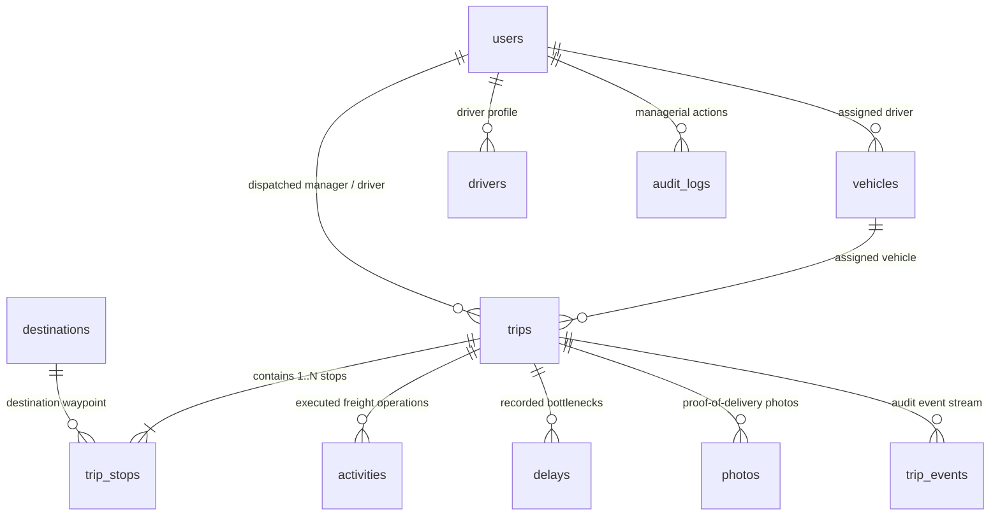

# TruckTracker — Dependency and Data-Model Map

**Version**: 2.0.0  
**Status**: Authoritative Architectural Baseline  
**Scope**: Full-Stack Inventory & Reconciled Production Plan  

---

## 1. Existing Database Tables & Schema Inventory

The primary relational persistence engine uses Node 22 native SQLite (`DatabaseSync` from `node:sqlite`) operating in WAL (Write-Ahead Logging) mode with strict foreign key constraints enabled.

| Table Name | Business Purpose | Primary Key | Foreign Keys & References | Notable Indexes | Lifecycle & Ownership |
| :--- | :--- | :--- | :--- | :--- | :--- |
| **`users`** | Identity, authentication credentials, and role assignments (Manager, Driver, Admin) | `id` (UUIDv4) | None | `email` (UNIQUE) | Created on onboarding, persistent. Managed by HR/Admin. |
| **`vehicles`** | Commercial freight fleet assets, telematics identifiers, operational availability | `id` (UUIDv4) | `assigned_driver_id` → `users(id)` | `vehicle_number` (UNIQUE) | Asset lifecycle (Available → On Trip → Maintenance → Inactive/Decommissioned). |
| **`drivers`** | Extended driver profile, employee identifier, assigned primary vehicle | `id` (UUIDv4) | `user_id` → `users(id)` (ON DELETE CASCADE), `assigned_vehicle_id` → `vehicles(id)` | `employee_id` (UNIQUE), `user_id` (UNIQUE) | Operational workforce roster. |
| **`destinations`** | Physical delivery customer hubs, distribution centers, and geofence boundaries | `id` (UUIDv4) | None | None | Master customer/depot data. Soft-deletable (`is_active = 0`). |
| **`trips`** | Dispatched delivery manifests, departure/arrival checkpoints, aggregate metrics | `id` (`TR-YYYY-NNNNN`) | `driver_id` → `users(id)`, `vehicle_id` → `vehicles(id)`, `created_by` → `users(id)` | `idx_trips_driver_status`, `idx_trips_date` | Dispatch lifecycle: Planned → Assigned → In Progress → At Destination → Delayed → Returning → Completed / Cancelled. |
| **`trip_stops`** | Ordered sequence of geofenced delivery/pickup stops per manifest | `id` (UUIDv4) | `trip_id` → `trips(id)` (ON DELETE CASCADE), `destination_id` → `destinations(id)` | `idx_trip_stops_trip_order` (trip_id, stop_number) | Stop lifecycle: Pending → Arrived → In Progress → Completed / Skipped / Failed. |
| **`activities`** | Quantified freight operations at a stop (cargo cartons, pallet delivery, sign-off) | `id` (UUIDv4) | `trip_id` → `trips(id)`, `stop_id` → `trip_stops(id)` | `idx_activities_stop` | Recorded during stop execution. |
| **`delays`** | Route bottlenecks reported in real time (traffic, road closure, border tax queue) | `id` (UUIDv4) | `trip_id` → `trips(id)`, `stop_id` → `trip_stops(id)`, `driver_id` → `users(id)`, `vehicle_id` → `vehicles(id)` | `idx_delays_trip` | Open → Resolved. Includes start/end timestamps and delay duration in minutes. |
| **`photos`** | Tamper-evident proof-of-delivery (POD) and delay photo metadata | `id` (UUIDv4) | `trip_id` → `trips(id)`, `stop_id` → `trip_stops(id)`, `driver_id` → `users(id)` | `idx_photos_trip` | Immutable timestamped audit records linked to local storage path. |
| **`trip_events`** | Granular chronological telemetry and status transition events | `id` (UUIDv4) | `trip_id` → `trips(id)`, `driver_id` → `users(id)`, `vehicle_id` → `vehicles(id)` | `idx_events_trip_time` (trip_id, timestamp) | Append-only event stream (e.g. `TRIP_DISPATCHED`, `GEOFENCE_ENTERED`). |
| **`audit_logs`** | Managerial change audit trail (cancellations, status overrides, route reorders) | `id` (UUIDv4) | `changed_by` → `users(id)` | None | Append-only security audit log. |
| **`google_sheet_sync`** | *Legacy Table (Deprecated)* Outbound sync status tracking (superseded by SQLite hot backups) | `id` (UUIDv4) | None | `idx_sheet_sync` (sheet_name, sync_status) | Deprecated in favor of direct ERP & hot backups. |

---

## 2. Existing Relationships & Cardinality



---

## 3. Existing Routes to Database Mutation Mapping

| Route Pattern | Method | Minimum Role | Request Body | Response Shape | Primary UI Consumer |
| :--- | :--- | :--- | :--- | :--- | :--- |
| `/api/auth/login` | `POST` | Public | `{ email, password }` | `{ token, user: { id, name, email, role } }` | `LoginModal.tsx` |
| `/api/auth/me` | `GET` | Authenticated | None | `{ user: { id, name, email, role } }` | `App.tsx` (Session Validation) |
| `/api/trips` | `GET` | Authenticated | None | `{ trips: TripWithDetails[] }` | `ManagerView.tsx`, `DriverView.tsx` |
| `/api/trips` | `POST` | `MANAGER` | `{ date, driver_id, vehicle_id, starting_location, planned_departure_time, stops }` | `{ message: 'Trip created', trip: { id, ... } }` | `CreateTripModal.tsx` |
| `/api/trips/:id` | `GET` | Authenticated | None | `{ trip: TripWithDetails }` | `TripDetailsModal.tsx` |
| `/api/trips/:id` | `PUT` | `MANAGER` | `{ driver_id, vehicle_id, planned_departure_time, ... }` | `{ message: 'Trip updated' }` | `EditTripModal.tsx` |
| `/api/trips/:id/cancel` | `POST` | `MANAGER` | `{ reason }` | `{ message: 'Trip cancelled' }` | `CancelTripModal.tsx` |
| `/api/driver/trips/active` | `GET` | `DRIVER` | None | `{ trip: TripWithDetails \| null }` | `DriverView.tsx` (Active Route) |
| `/api/trips/:id/events` | `POST` | Authenticated | `{ event_type, stop_id, latitude, longitude, gps_accuracy, idempotency_key, metadata }` | `{ success: true, event_id }` | `DriverView.tsx`, `offlineQueue.ts` |
| `/api/delays` | `POST` | Authenticated | `{ trip_id, stop_id, reason, notes, latitude, longitude }` | `{ message: 'Delay reported', id }` | `DelayModal.tsx` |
| `/api/delays/:id/resolve` | `PUT` | Authenticated | `{ notes }` | `{ message: 'Delay resolved' }` | `DriverView.tsx` (Delay Banner) |
| `/api/fleet/vehicles` | `GET` | Authenticated | None | `{ vehicles: Vehicle[] }` | `ManagerView.tsx` (Vehicle Registry) |
| `/api/fleet/vehicles` | `POST` | `MANAGER` | `{ vehicle_number, vehicle_type, model, assigned_driver_id, status, notes }` | `{ message: 'Vehicle created', id }` | `VehicleModal.tsx` |
| `/api/fleet/vehicles/:id` | `PUT` | `MANAGER` | `{ vehicle_number, vehicle_type, model, assigned_driver_id, status, notes }` | `{ message: 'Vehicle updated' }` | `VehicleModal.tsx` |
| `/api/fleet/vehicles/:id` | `DELETE` | `MANAGER` | None | `{ message: 'Vehicle deleted' }` | `ManagerView.tsx` (Decommission) |
| `/api/fleet/drivers` | `GET` | Authenticated | None | `{ drivers: Driver[] }` | `ManagerView.tsx` (Driver Directory) |
| `/api/fleet/drivers` | `POST` | `MANAGER` | `{ name, email, phone, employee_id, assigned_vehicle_id, password }` | `{ message: 'Driver created', id }` | `DriverModal.tsx` |
| `/api/fleet/destinations` | `GET` | Authenticated | None | `{ destinations: Destination[] }` | `ManagerView.tsx`, `DriverView.tsx` |
| `/api/fleet/destinations` | `POST` | `MANAGER` | `{ name, address, latitude, longitude, contact_name, contact_number, geofence_radius_meters, notes }` | `{ message: 'Destination created', id }` | `DestinationModal.tsx` |
| `/api/fleet/destinations/:id` | `DELETE` | `MANAGER` | None (checks for active trips before soft-delete) | `{ message: 'Destination deactivated' }` | `ManagerView.tsx` |
| `/api/reports/daily` | `GET` | `MANAGER` | Query: `date` | `{ date, overview: { totalTrips, completedTrips, onTimePercentage, totalDelayFormatted, ... }, trips, delayReasons, driverSummary, vehicleSummary }` | `ManagerView.tsx` (Performance Analytics) |
| `/api/reports/periodic` | `GET` | `MANAGER` | Query: `period` (`weekly` \| `monthly`) | Unified schema: `{ period, daysAnalyzed, overview, metrics, trips, delayReasons, driverSummary, vehicleSummary }` | `ManagerView.tsx` (Rolling Audit View) |
| `/api/reports/export` | `GET` | `MANAGER` | Query: `date` | `Content-Type: text/csv` (Formatted spreadsheet download) | `ManagerView.tsx` (Export Operational CSV) |
| `/api/photos/upload` | `POST` | Authenticated | Multipart `FormData` (`photo`, `trip_id`, `stop_id`, `photo_type`) | `{ id, file_path, file_size, mime_type, timestamp }` | `CameraModal.tsx` |
| `/api/backup/create` | `POST` | `MANAGER` | None | `{ success: true, backup: { filename, path, size, createdAt } }` | `SettingsView.tsx` (System Maintenance) |
| `/api/health` | `GET` | Public | None | `{ status: 'healthy', timestamp, service }` | Render Health Check & Uptime monitoring |

---

## 4. 100% Production Data Architecture (Zero Mock Data)

The codebase strictly enforces production-grade data integrity:
1. **Authoritative Backend Data Source**:
   - Web application interacts with `/api/*` backed by SQLite on the Node Express server.
   - All manager dispatches, driver departures, photos, and delays write directly to SQLite relational tables and generate persistent audit logs.
2. **Complete Elimination of Mock Data**:
   - The legacy `mockData.ts` and `mockStore` layers have been **completely eliminated** from the codebase.
   - No mock Tata trucks, fictitious challan records, or hardcoded driver manifests are injected into the frontend.
   - If the backend returns an empty list, the UI renders clean, authentic empty states.
3. **Offline Field Queueing (`web/src/services/offlineQueue.ts`)**:
   - In low-connectivity freight corridors, `offlineQueue` intercepts network errors and stores pending events in `localStorage`.
   - When network connectivity is restored, events are automatically flushed to the backend using UUID idempotency keys to ensure zero duplication.

---

## 5. Existing Production Data Assumptions & Render Persistence Audit

### Critical Persistence Finding on Render
- **Infrastructure**: Render Web Service `truck-tracker-api` (Plan: `free`).
- **File System Nature**: The local container disk on Render Free is **ephemeral**.
  - If the free instance spins down due to 15 minutes of inactivity or is restarted/redeployed, any file written to `data/truck_tracker.sqlite` is reset.
  - Render persistent disks (`render.yaml` `disks`) are supported only on paid tiers (`starter` plan and above).
- **Engineering Repercussions**:
  1. SQLite is ideal for single-container development, testing, and edge nodes, but requires either a mounted persistent disk or external PostgreSQL connection for multi-year enterprise production durability.
  2. The application startup must execute idempotent migrations automatically so that fresh container instances boot safely into a consistent schema.
  3. The database layer must cleanly decouple SQL queries into a repository pattern so that switching to PostgreSQL requires zero rewrites of Express route handlers.

---

## 6. Existing Authentication & Authorization Architecture

- **Tokens**: Stateless JSON Web Tokens (JWT) signed with `JWT_SECRET` and expiring after 24 hours.
- **Middleware (`server/src/middleware/auth.ts`)**:
  - `requireAuth`: Extracts `Bearer <token>`, validates cryptographic signature, loads `req.user = { id, email, role, name }`.
  - `requireRole('MANAGER')`: Restricts administrative endpoints (dispatch creation, fleet modification, CSV audit export).
  - `logAudit()`: Records who modified what field with before/after snapshots.
- **Passwords**: Hashed using `bcryptjs` with salt work factor 10.

---

## 7. Reconciled Enterprise Domain Model (SAP/TMS Ready)

To support future ERP/TMS integration without fake implementations, canonical business entities are classified into:

```
[Core Master Data]
  ├── users & roles (Auth & RBAC)
  ├── vehicles (Fleet Assets)
  │     ├── vehicle_documents (RC, Insurance, Fitness, PUC compliance)
  │     ├── maintenance_records (Preventive & Corrective services)
  │     └── fuel_transactions (Fuel cards, liters, cost per km)
  ├── drivers (Workforce)
  └── destinations & depots (Geofenced nodes)

[Transactional Operations]
  └── trips (Dispatch Manifests)
        ├── trip_stops (Ordered sequence)
        │     └── activities (Cargo operations)
        ├── delays (Corridor bottlenecks)
        ├── photos (POD evidence)
        ├── trip_events (Lifecycle telemetry stream)
        └── operational_exceptions (Escalated SLA / compliance issues)
```

### Identifier Separation
- **Internal Database Primary Keys**: UUIDv4 (`id`) for internal referential integrity.
- **Human-Readable Business Keys**: `TR-2026-00001` for dispatchers; `DL01 TA 4920` for vehicles; `EMP-DRV-101` for drivers.
- **External ERP/SAP References**:
  - `vehicles.fleet_unit_id` (SAP Equipment / Asset No)
  - `trips.sap_shipment_num` (SAP TM / LE-TRA Shipment No)
  - `trips.erp_delivery_doc` (SAP Delivery Document No)
  - `trips.cost_center` (SAP CO Cost Center)

---

## 8. Migration Strategy

Instead of ad-hoc `CREATE TABLE IF NOT EXISTS` scattered across files, we establish an ordered migration engine:
1. Migration catalog table: `_schema_migrations (version INTEGER PRIMARY KEY, name TEXT NOT NULL, applied_at DATETIME)`
2. Ordered migration files in `server/src/migrations/`:
   - `001_initial_schema.sql` (baseline core tables)
   - `002_add_enterprise_tables.sql` (documents, maintenance, fuel, exceptions)
   - `003_add_erp_references_and_indexes.sql` (SAP fields, composite performance indexes)
3. Executable via `npm run migrate` or auto-run idempotently upon server startup.
