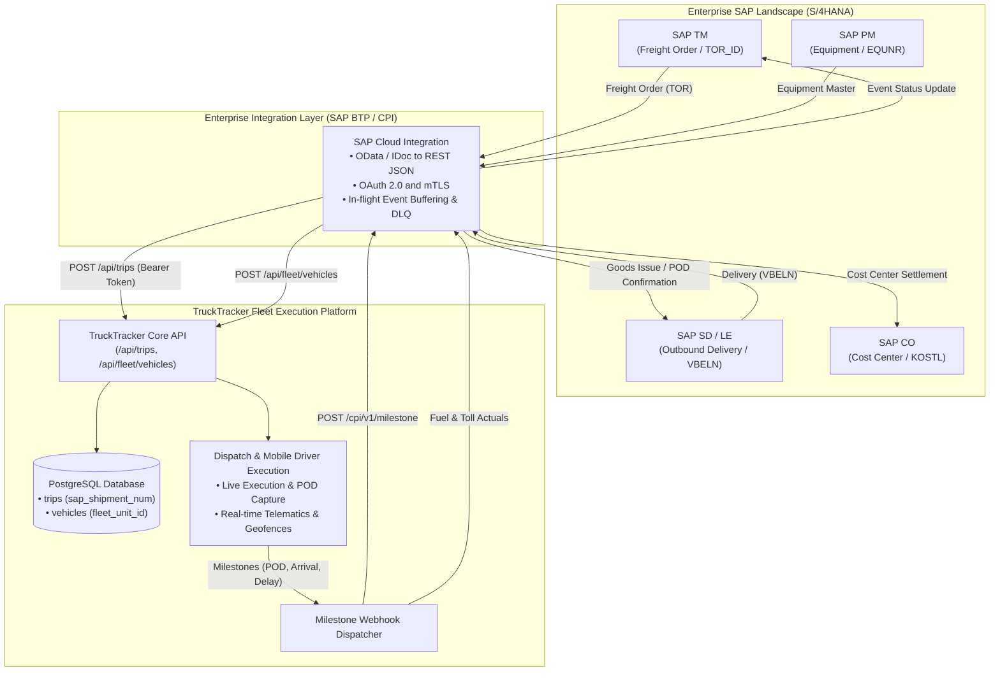

# 🏢 SAP ERP & S/4HANA Integration Architecture

This document provides the authoritative engineering specification for integrating **TruckTracker** with enterprise SAP environments (**SAP S/4HANA Cloud / On-Premise**, **SAP ECC 6.0**, **SAP TM (Transportation Management)**, and **SAP PM (Plant Maintenance)**).

---

## 1. Architectural Principles

TruckTracker is designed as an **edge execution system** for fleet operations and mobile drivers. It does **not** attempt to replicate SAP internal database tables. Instead, it acts as the execution layer that exchanges clean business events and status updates with SAP through standard enterprise integration protocols:

1. **Decoupled Identity**: Internal TruckTracker records maintain their own canonical primary keys (`UUID` / `TR-YYYY-NNNNN`) and store external SAP business keys as indexed foreign reference columns.
2. **Idempotent Ingestion**: All SAP inbound webhooks and outbound status callbacks require an `idempotency_key` or use the SAP unique document number to prevent duplicate trip or document creation.
3. **Auditability**: Every change triggered via SAP integration is recorded in `audit_logs` with `changed_by = 'SYSTEM_SAP_INTEGRATION'` and the corresponding SAP transaction reference.
4. **Resilience**: Communication between TruckTracker and SAP is mediated via asynchronous queues and dead-letter handling so network hiccups never interrupt road drivers.

---

## 2. SAP Module Mapping Matrix

| SAP Module | SAP Business Object | TruckTracker Relational Entity | Integration Fields / Key Mappings | Flow Direction |
|---|---|---|---|:---:|
| **SAP TM** (Transportation Management) | Freight Order / Shipment (`TOR_ID` / `TKNUM`) | `trips` | `sap_shipment_num`, `reference_number`, `date`, `planned_departure_time` | Bi-directional (SAP ➔ TT ➔ SAP) |
| **SAP SD/LE** (Sales & Distribution / Logistics) | Outbound Delivery (`VBELN`) | `trips` & `trip_stops` | `erp_delivery_doc`, `cargo_activities.reference_number` | Bi-directional |
| **SAP PM** (Plant Maintenance) | Equipment Master (`EQUNR`) | `vehicles` | `fleet_unit_id`, `chassis_number`, `vehicle_number` | SAP ➔ TT |
| **SAP PM** (Plant Maintenance) | Maintenance Order (`AUFNR`) | `maintenance_records` | `invoice_reference`, `odometer_km`, `service_type` | TT ➔ SAP |
| **SAP CO** (Controlling) | Cost Center (`KOSTL`) / Internal Order | `trips` & `fuel_transactions` | `cost_center`, `fuel_transactions.total_cost` | TT ➔ SAP |
| **SAP HR/HCM** (Human Capital) | Personnel Number (`PERNR`) | `drivers` / `users` | `employee_id`, `phone`, `license_number` | SAP ➔ TT |

---

## 3. Integration Topology Diagram



```
┌─────────────────────────────────────────────────────────────────────────────────┐
│                           Enterprise SAP Landscape                              │
│                                                                                 │
│   ┌─────────────────────┐   ┌──────────────────────┐   ┌────────────────────┐   │
│   │ SAP S/4HANA (SD/LE) │   │ SAP TM (Shipments)   │   │ SAP PM (Fleet Eq.) │   │
│   │ Deliveries (VBELN)  │   │ Freight Orders (TOR) │   │ Equipment (EQUNR)  │   │
│   └──────────┬──────────┘   └──────────┬───────────┘   └─────────┬──────────┘   │
└──────────────┼─────────────────────────┼─────────────────────────┼──────────────┘
               │                         │                         │
               ▼                         ▼                         ▼
┌─────────────────────────────────────────────────────────────────────────────────┐
│               Enterprise Middleware / Integration Layer                         │
│               (SAP Integration Suite / Cloud Connector / BTP)                  │
│                                                                                 │
│   • Protocol Transformation: IDoc / OData v4 / SOAP ➔ REST / JSON               │
│   • Authentication: OAuth 2.0 Client Credentials + mTLS                         │
│   • Queue & Retry: In-flight event buffering & dead-letter alerting             │
└──────────────────────────────────────┬──────────────────────────────────────────┘
                                       │
                                       │ Secure HTTPS (Bearer Token / Webhooks)
                                       ▼
┌─────────────────────────────────────────────────────────────────────────────────┐
│                          TruckTracker API Engine                                │
│                                                                                 │
│   ┌─────────────────────────────────────────────────────────────────────────┐   │
│   │ Inbound Webhooks & REST Endpoints                                       │   │
│   │ • POST /api/trips            (Ingest SAP Freight Order into Manifest)   │   │
│   │ • POST /api/fleet/vehicles   (Synchronize SAP PM Equipment Roster)      │   │
│   │ • PUT  /api/trips/:id        (Update Stop Schedules / Carrier Reassign) │   │
│   └────────────────────────────────────┬────────────────────────────────────┘   │
│                                        │
│   ┌────────────────────────────────────┴────────────────────────────────────┐   │
│   │ Event-Driven Outbound Callbacks                                         │   │
│   │ • STOP_ARRIVED     ➔ SAP TM Milestone: Arrived at Geofence              │   │
│   │ • DELIVERY_PROOF   ➔ SAP SD Event: Goods Issue / POD Confirmation       │   │
│   │ • TRIP_DELAYED     ➔ SAP TM Alert: Exception / Delivery Rescheduled     │   │
│   │ • TRIP_COMPLETED   ➔ SAP TM Settlement: Base Arrival & Completion       │   │
│   └─────────────────────────────────────────────────────────────────────────┘   │
└─────────────────────────────────────────────────────────────────────────────────┘
```

---

## 4. Inbound Workflow: Ingesting Freight Orders from SAP TM

When a shipment is finalized in SAP TM or an outbound delivery is released in SAP SD, the middleware invokes TruckTracker's authenticated REST endpoint to instantiate an operational trip manifest.

### Endpoint: `POST /api/trips`
**Authorization**: `Bearer <JWT_TOKEN>` (Service Account with `MANAGER` role)

#### Request Payload:
```json
{
  "date": "2026-09-14",
  "driver_id": "8f8b8e0e-8f20-4e5a-b605-e11b3433604a",
  "vehicle_id": "b18b4507-6f17-48f8-b3d6-728b7468164b",
  "starting_location": "Company North Central Depot",
  "starting_latitude": 28.5355,
  "starting_longitude": 77.2680,
  "purpose": "Express Cargo Delivery",
  "reference_number": "PO-NCR-99120",
  "planned_departure_time": "08:30",
  "sap_shipment_num": "0000084920",
  "erp_delivery_doc": "0080014522",
  "cost_center": "CC-LOG-DELHI-01",
  "notes": "Direct B2B delivery from SAP TM Order #84920",
  "stops": [
    {
      "destination_id": "d1a8e104-9a2e-4b20-80ea-7b6a18cb4920",
      "destination_name": "Lajpat Nagar Central Transit Hub",
      "address": "Ring Road Commercial Complex, Lajpat Nagar, New Delhi",
      "latitude": 28.5677,
      "longitude": 77.2433,
      "geofence_radius_meters": 150,
      "planned_arrival_time": "09:15",
      "notes": "Unload Pallets 1 through 4 (Material #MAT-8840)"
    },
    {
      "destination_name": "Noida Sector 62 Electronic City Mega Hub",
      "address": "Block C, Electronic City, Sector 62, Noida",
      "latitude": 28.6280,
      "longitude": 77.3680,
      "geofence_radius_meters": 250,
      "planned_arrival_time": "11:00",
      "notes": "Deliver final pallet to Dock Bay 4"
    }
  ]
}
```

#### Response:
```json
{
  "message": "Trip created successfully",
  "tripId": "TR-2026-00003"
}
```

---

## 5. Outbound Workflow: Status & POD Confirmation Back to SAP

As field drivers use the mobile application, TruckTracker triggers status webhooks back to SAP.

### 1. Milestone Event: Checkpoint Arrival (Geofence Verified)
When a driver reaches a customer stop and the system verifies GPS within the geofence perimeter (<= 250m):
```json
{
  "event": "MILESTONE_REACHED",
  "sap_shipment_num": "0000084920",
  "erp_delivery_doc": "0080014522",
  "milestone": "ARRIVED_AT_STOP",
  "stop_number": 1,
  "timestamp": "2026-09-14T09:18:22Z",
  "location": {
    "latitude": 28.5676,
    "longitude": 77.2434,
    "geofence_variance_meters": 14
  }
}
```
*SAP Action*: Updates Shipment Stage status in SAP TM (`VTTK-STTRG`).

---

### 2. Proof of Delivery (POD) with Photo Verification
When cargo is signed off and a photo proof is uploaded via CameraX:
```json
{
  "event": "PROOF_OF_DELIVERY_CONFIRMED",
  "sap_shipment_num": "0000084920",
  "erp_delivery_doc": "0080014522",
  "recipient_name": "Satish Chawla",
  "quantity_delivered": 4,
  "photo_proof_url": "https://truck-tracker-api-9yhq.onrender.com/uploads/pod-84920-stop1.jpg",
  "signed_at": "2026-09-14T09:34:10Z"
}
```
*SAP Action*: Posts Goods Issue (PGI) in SAP SD (`WS_DELIVERY_UPDATE`) and attaches POD archive link.

---

### 3. Transit Exception & Delay Notice
When a driver logs a traffic bottleneck or vehicle breakdown:
```json
{
  "event": "OPERATIONAL_EXCEPTION",
  "sap_shipment_num": "0000084920",
  "severity": "WARNING",
  "reason": "TRAFFIC",
  "delay_minutes": 25,
  "estimated_arrival_revised": "2026-09-14T11:25:00Z",
  "driver_notes": "Heavy congestion at Ghazipur border checkpoint"
}
```
*SAP Action*: Generates alert in SAP TM Transportation Cockpit and recalculates estimated delivery window.

---

## 6. Vehicle Equipment Synchronization (SAP PM ➔ TruckTracker)

Vehicles tracked in SAP Plant Maintenance as equipment records (`EQUNR`) are mapped to TruckTracker via `fleet_unit_id`.

### Endpoint: `POST /api/fleet/vehicles`
```json
{
  "vehicle_number": "DL01 TA 4920",
  "vehicle_type": "HEAVY_TRUCK",
  "model": "Tata Prima 2830.K",
  "fleet_unit_id": "EQ-SAP-99410",
  "chassis_number": "MAT628490N0184920",
  "telematics_imei": "864920049102941",
  "status": "AVAILABLE",
  "notes": "Dedicated Fleet Asset — Assigned to Delhi-NCR Restock Run"
}
```

---

## 7. Security, Authentication & Deployment Checklist

1. **Service Account Authentication**:
   - Issue a dedicated system user in `users` with `role = 'MANAGER'` and `email = 'sap-integration@company.com'`.
   - SAP requests must pass `Authorization: Bearer <JWT_TOKEN>`.
2. **Mutual TLS (mTLS)**:
   - For enterprise production deployments, configure reverse-proxy (Nginx / Cloudflare / AWS ALB) to terminate client certificates issued by your company's internal PKI.
3. **Network Allowlisting**:
   - Restrict incoming SAP API calls to corporate egress IP addresses or private VPC peering.
4. **Idempotency**:
   - Ensure the middleware re-uses the same `reference_number` or `sap_shipment_num` on retry to avoid generating duplicate trips.
