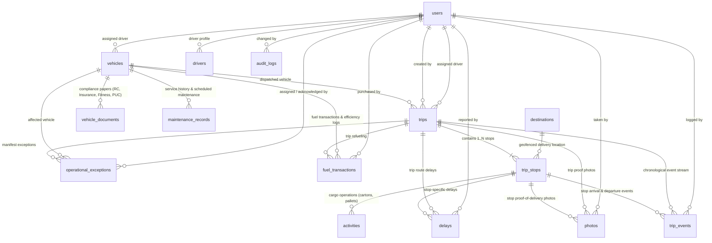

# Entity Relationship Diagram (ERD)

This diagram documents the complete relational data model of the TruckTracker database.

---

## Relationship Cardinality & Invariants

1. **`users` 1 → 0..1 `drivers`**:
   A driver user profile maps to exactly one extended driver record with unique employee payroll ID.
2. **`vehicles` 1 → 0..N `vehicle_documents`**:
   Each vehicle has multiple statutory compliance records (Registration Certificate, Commercial Insurance, RTO Fitness, and PUC) with tracked expiry dates.
3. **`vehicles` 1 → 0..N `maintenance_records`**:
   Complete chronological audit of preventive and corrective maintenance.
4. **`trips` 1 → 1..N `trip_stops`**:
   A trip manifest cannot exist without at least one scheduled stop. Deleting a trip cascades to all associated stops, activities, photos, and events.
5. **`destinations` 1 → 0..N `trip_stops`**:
   Destinations cannot be hard-deleted if referenced by active trips. Deactivation sets `is_active = 0` (soft delete) to protect historical manifest auditability.
