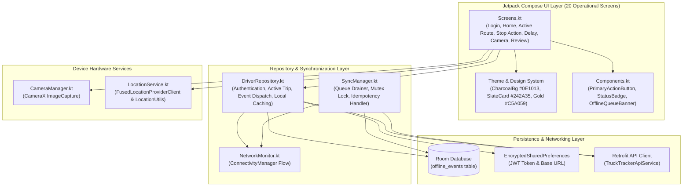
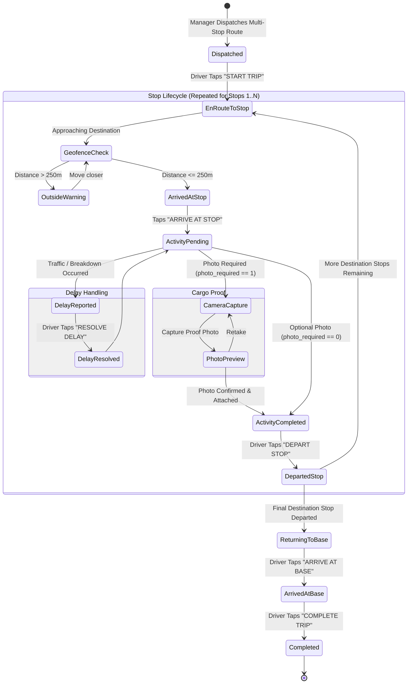
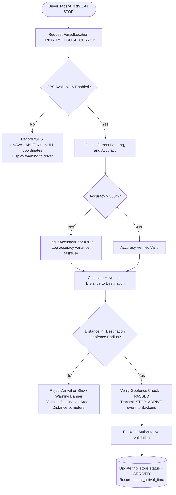
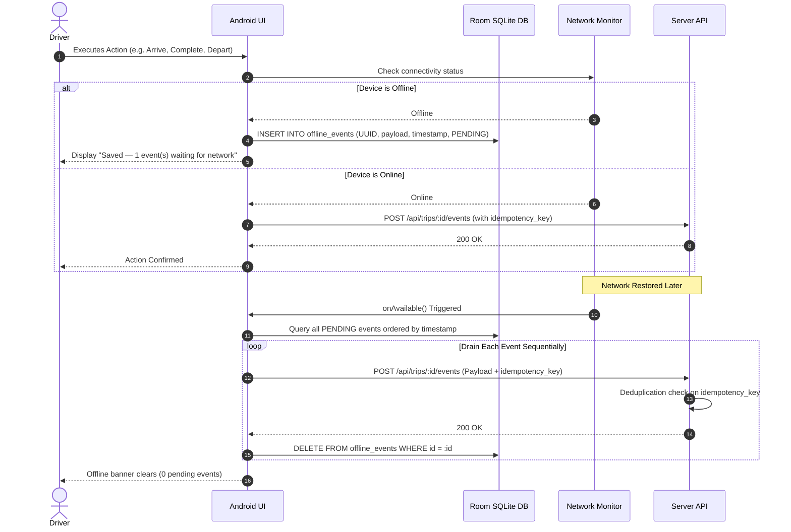

# 📱 TruckTracker — Android Application Guide

## 1. Overview & Technology Stack

The TruckTracker Android application is a native client designed exclusively for company logistics drivers operating in the field.

| Component | Library / API | Rationale |
|---|---|---|
| **Language & Tooling** | Kotlin 2.0, Android SDK 34, AGP 8.5.2 | Modern concise Android development, SDK 34 compliance |
| **UI Framework** | Jetpack Compose & Material 3 | Declarative, reactive UI, no XML fragments, zero lag |
| **Local Persistence** | Android Room Database (SQLite) | Persistent offline queue storage for uninterrupted field operation |
| **Secure Storage** | EncryptedSharedPreferences (AES256) | Hardware Keystore-backed storage for JWT tokens and driver profiles |
| **Networking** | Retrofit 2.11 + OkHttp 4.12 | Typed REST client with dynamic server URL switching and retry policies |
| **Hardware Camera** | CameraX 1.3.4 (Lifecycle, View, Camera2) | Native viewfinder, aspect-ratio locked photo capture, JPEG compression |
| **Location Services** | Google Play Services Fused Location | High-accuracy GPS fixes, accuracy variance checks, Haversine geofence |
| **Network Monitoring** | Android `ConnectivityManager` | Reactive connection state flow, automatic offline queue draining |

---

## 2. Android Layered Architecture

---

## 3. Driver Stop Execution State Machine

---

## 4. Geofence & GPS Verification Flow

---

## 5. The 20 Driver Screens & States

1. **Splash Screen & Session Loader**: Checks local `EncryptedSharedPreferences` for cached JWT token. Automatically routes to Home if active, or Login if expired.
2. **Login Screen & Server Config**: Sign in via email and password. Includes an on-device server configuration panel allowing drivers and technicians to switch between LAN, Emulator, and Production HTTPS.
3. **Driver Home Screen**: Displays active vehicle registration plate, today's route progress summary ("2 of 4 stops completed"), and next action button.
4. **Today's Trips Screen**: Lists all scheduled and dispatched routes assigned to the driver.
5. **Trip Details Screen**: Overview of the full ordered multi-stop sequence (`BASE → STOP 1 → STOP 2 → ... → BASE`).
6. **Stop Details Screen**: Customer address, contact person, delivery instructions, cargo quantity, and required proof indicator.
7. **Arrival & Geofence Screen**: Live location check against destination coordinates. Displays distance and arrival verification status.
8. **Activity Execution Screen**: Cargo signoff, quantity confirmation, and photo proof verification.
9. **Camera Screen**: Full-screen CameraX viewfinder with touch-to-capture and orientation lock.
10. **Photo Review Screen**: Preview captured proof photo, select category (*Delivery Proof*, *Damage*, *Signature*), and confirm.
11. **Delay Report Screen**: Select standard delay reason (*Traffic Congestion*, *Mechanical Breakdown*, *Adverse Weather*, *Customer Unavailable*, *Accident*) with optional notes.
12. **Active Delay Banner**: Persistent warning banner displaying elapsed delay timer and a high-visibility "Resolve Delay" action.
13. **Return Journey Screen**: Trigger return journey departure once the final destination stop is completed.
14. **Base Arrival Screen**: Record arrival back at the company headquarters/depot gate.
15. **Trip Completion Summary**: Operational summary showing stops completed, total travel duration, delay minutes, and attached photos.
16. **Trip History Screen**: Chronological archive of past completed routes.
17. **Driver Profile Screen**: Displays driver name, employee ID, assigned truck, and sign-out action.
18. **Offline Queue Screen**: Real-time counter of queued offline events with manual synchronization button.
19. **Error / GPS Unavailable Screen**: Clean recoverable error states with retry controls; coordinates are never fabricated.
20. **Runtime Permissions Handler**: Android runtime permission prompts for Fine Location, Coarse Location, and Camera.

---

## 6. Offline Queue & Idempotency Guarantees

---

## 7. In-Cab Digital Vehicle Papers & Automated CI/CD

### A. Digital Vehicle Papers Access
Field drivers can view verified digital copies of their vehicle's statutory papers (Registration Certificate, Commercial Insurance, Road Fitness, PUC, and National Permit) directly from the mobile app. This allows drivers to immediately present verified credentials during police and RTO roadside checks.

### B. Automated GitHub Actions Build & In-App Sync
- `.github/workflows/deploy.yml` compiles `TruckTracker-Driver-v1.1.0-debug.apk` on every push to `main`.
- The backend serves `GET /api/app-version` containing current release metadata and download URLs.
- The mobile application checks this endpoint to alert drivers when a new release is available.

