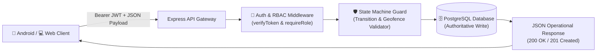

# 🌐 TruckTracker — REST API Specification



---

## 1. Authentication Endpoints

### `POST /api/auth/login`
Authenticates a user (Manager, Driver, or Admin).
- **Request Body**:
  ```json
  {
    "email": "rahul@company.com",
    "password": "driver123"
  }
  ```
- **Response** (`200 OK`):
  ```json
  {
    "success": true,
    "data": {
      "token": "eyJhbGciOi...",
      "user": {
        "id": "91039c64-8264-4e41-804d-ae5d6ff563a3",
        "name": "Rahul Sharma",
        "email": "rahul@company.com",
        "role": "DRIVER"
      }
    }
  }
  ```

### `GET /api/auth/me`
Retrieves the currently authenticated user profile.

---

## 2. Trip Management Endpoints (Manager Role)

### `GET /api/trips`
Retrieves all trips with optional status filtering (`?status=IN_PROGRESS`).

### `POST /api/trips`
Creates a multi-stop trip.
- **Request Body**:
  ```json
  {
    "driver_id": "91039c64-...",
    "vehicle_id": "c0559f03-...",
    "starting_location_id": "069cb601-...",
    "planned_departure": "2026-09-09T08:00:00.000Z",
    "purpose": "Retail distribution",
    "stops": [
      {
        "destination_id": "270db69c-...",
        "planned_arrival": "2026-09-09T09:00:00.000Z",
        "activity": {
          "activity_type": "DELIVERY",
          "quantity": 25,
          "photo_required": 1
        }
      },
      {
        "destination_id": "bfdcb3c3-...",
        "planned_arrival": "2026-09-09T10:30:00.000Z",
        "activity": {
          "activity_type": "PICKUP",
          "quantity": 10,
          "photo_required": 0
        }
      }
    ]
  }
  ```

### `PUT /api/trips/:id`
Updates planned trip details prior to dispatch (driver, vehicle, departure time, purpose, notes).

### `POST /api/trips/:id/reorder-stops`
Reorders destination stops prior to trip start.
- **Request Body**:
  ```json
  {
    "stop_ids": ["stop-uuid-2", "stop-uuid-1"]
  }
  ```

### `POST /api/trips/:id/stops`
Adds a new destination stop to an unstarted trip.

### `DELETE /api/trips/:id/stops/:stopId`
Removes a destination stop from an unstarted trip and re-indexes remaining stops.

### `POST /api/trips/:id/cancel`
Cancels a trip with a mandatory operational reason. Releases assigned vehicle to `AVAILABLE`.

### `GET /api/trips/overview/attention`
Retrieves count and items for the manager's Attention Required center.

---

## 3. Driver Operational Endpoints (Driver Role)

Drivers can only query and mutate trips assigned to their driver ID (`trip.driver_id === req.user.id`).

### `GET /api/driver/assigned-trip`
Returns the driver's current active or upcoming trip with full stop hierarchy.

### `GET /api/driver/trips/active`
Returns the driver's single currently active trip (status `IN_PROGRESS`, `AT_DESTINATION`, `DELAYED`, or `RETURNING`) with full stop, event, and open-delay detail. Returns `{ trip: null }` if no active trip. Used as the **fast-path** on Android startup and web reconnect — a single optimised query vs scanning all today's trips.

### `GET /api/driver/todays-trips`
Returns all trips scheduled for today for the driver.

### `POST /api/driver/trips/:id/start`
Starts a trip. Records server-authoritative timestamp, optional start odometer, and GPS coordinates.

### `POST /api/driver/stops/:id/arrive`
Records stop arrival. Checks geofence distance against destination coordinates (100–250m).

### `POST /api/driver/stops/:id/activity`
Completes delivery/pickup activity. Enforces required proof photo check if `photo_required === 1`.

### `POST /api/driver/stops/:id/depart`
Records stop departure. Rejects if activity is not completed.

### `POST /api/driver/trips/:id/delay`
Reports an operational delay (Traffic, Breakdown, Weather, etc.) with GPS coordinates.

### `POST /api/driver/delays/:id/resolve`
Resolves an active delay. Automatically calculates delay duration in minutes.

### `POST /api/driver/trips/:id/start-return`
Starts return journey to base depot. Rejects if any required stops remain incomplete.

### `POST /api/driver/trips/:id/arrive-base`
Records arrival back at company base depot.

### `POST /api/driver/trips/:id/complete`
Completes the entire trip. Calculates total GPS distance and releases vehicle to `AVAILABLE`.

---

## 4. Photos & Proofs

### `POST /api/photos/upload`
Uploads a multipart photo proof (`image/jpeg`, `image/png`, `image/webp`).
- **Form Data Fields**:
  - `photo`: File stream
  - `trip_id`: Trip UUID
  - `stop_id`: Stop UUID (optional)
  - `photo_type`: `DELIVERY_PROOF`, `PICKUP_PROOF`, `DELAY_PROOF`, `DAMAGE`, etc.
  - `latitude`: Number (optional)
  - `longitude`: Number (optional)
  - `gps_accuracy`: Number (optional)

### `GET /api/photos/trip/:tripId`
Lists all photos uploaded on a trip, each with a `url` convenience field and joined `destination_name` / `stop_number` from the associated stop. Managers see all trip photos; drivers may only query their own assigned trips.

### `GET /api/photos/:id/file`
Securely streams the photo file with MIME type validation. **Requires authentication** (JWT Bearer). Drivers may only stream photos from their own trips.

---

## 5. Fleet Management

### `GET /api/fleet/destinations`
Lists all active destination points.

### `POST /api/fleet/destinations`
Creates a new destination.

### `PUT /api/fleet/destinations/:id`
Updates destination fields. Pass `is_active: 0` to soft-deactivate.

### `DELETE /api/fleet/destinations/:id`
Soft-deactivates a destination (sets `is_active = 0`). **Refuses if any currently active or in-progress trips reference the destination.** Historical trip and stop records are never orphaned — the reference is preserved, the destination simply no longer appears in the trip creator dropdown. Logs a `DESTINATION_DEACTIVATED` audit entry.

---

## 6. Reports & Operational Analytics

### `GET /api/reports/daily?date=YYYY-MM-DD`
Retrieves aggregated fleet operational metrics for a specific date (trips, delays, on-time arrivals).

### `GET /api/reports/periodic?period=weekly|monthly`
Aggregated metrics across the last 7 or 30 days.

### `GET /api/reports/export?date=YYYY-MM-DD`
Streams a formatted CSV operational report for dispatch and accounting records.

---

## 7. Database Backup

### `POST /api/backup/create`
Creates a verified database backup according to the configured database provider policy. PostgreSQL uses provider or `pg_dump` tooling; Microsoft SQL Server uses the company SQL Server backup and restore procedure.
