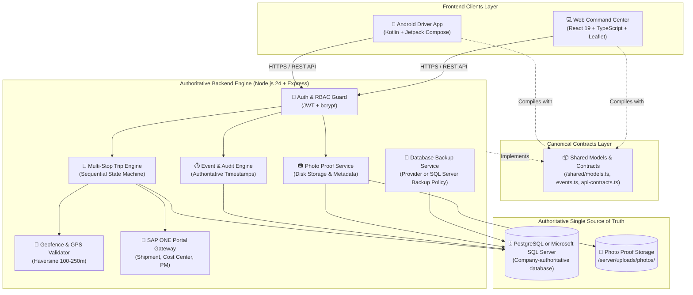
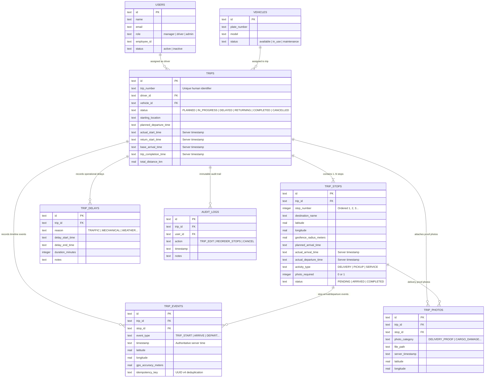
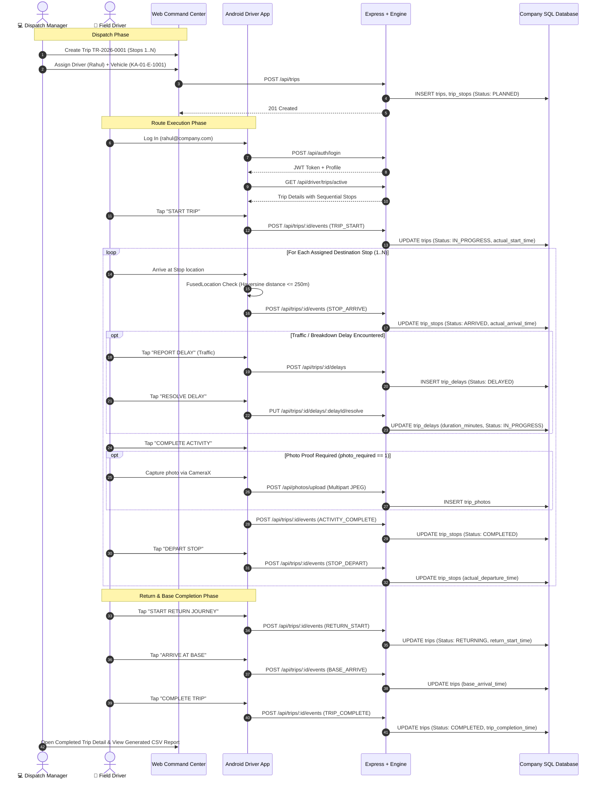
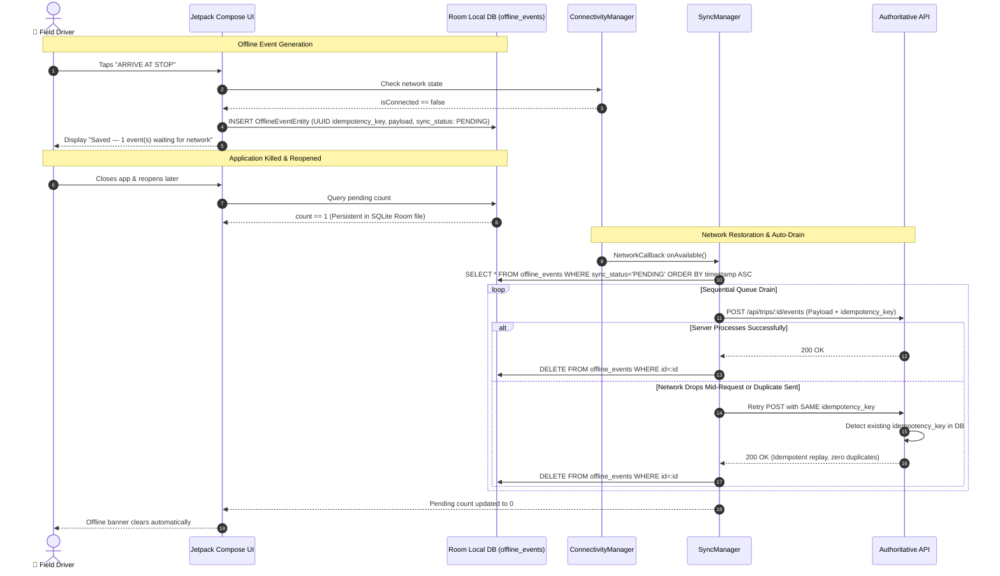

# 🏛️ TruckTracker — System Architecture Documentation

## 1. Architectural Overview

TruckTracker is an internal logistics operational platform designed for company fleets, field drivers, and dispatch managers. It consists of:
1. **Native Android Driver Application (`android/`)**: Primary mobile field client for drivers built with Kotlin, Jetpack Compose, CameraX, and Room.
2. **Web Manager Application (`web/`)**: Desktop/tablet dispatch command center for fleet managers built with React 19, TypeScript, and Leaflet.
3. **Shared Contracts & Models (`shared/`)**: Canonical data models, event definitions, and API contracts ensuring consistency across all layers.
4. **Authoritative Shared Backend (`server/`)**: Express + Node.js + a selectable PostgreSQL or Microsoft SQL Server database driver enforcing all business rules, authentication, event integrity, photo storage, reporting, and SAP ONE Portal / ERP integration.

---

## 2. Multi-Client Component Topology

---

## 3. Database Entity Relationship Diagram (ERD)

---

## 4. End-to-End Operational Lifecycle Sequence Flow

---

## 5. Offline Queue & Idempotency Architecture

---

## 6. Core Architectural Guarantees

1. **Anti-Tampering Timestamps**: Operational timestamps (`actual_start_time`, `actual_arrival_time`, `actual_departure_time`, `trip_completion_time`) are generated strictly by the server. Manipulating device clocks has zero impact on records.
2. **Planned vs. Actual Immutability**: Planned arrival schedules are immutable baseline targets. Real-world differences are logged as variance metrics (+/- minutes) and never overwrite planned targets.
3. **Strict RBAC & Driver Isolation**: Drivers can query and mutate only trips assigned to their `driver_id`. Cross-driver access attempts return HTTP 404/403.
4. **Authoritative SQL Database & ERP Gateway**: The configured PostgreSQL or Microsoft SQL Server database is the authoritative source of truth. All operational metrics, route logs, and proof records are persisted with atomic transactions, while enterprise fields integrate with central ERP systems such as SAP Business One.
