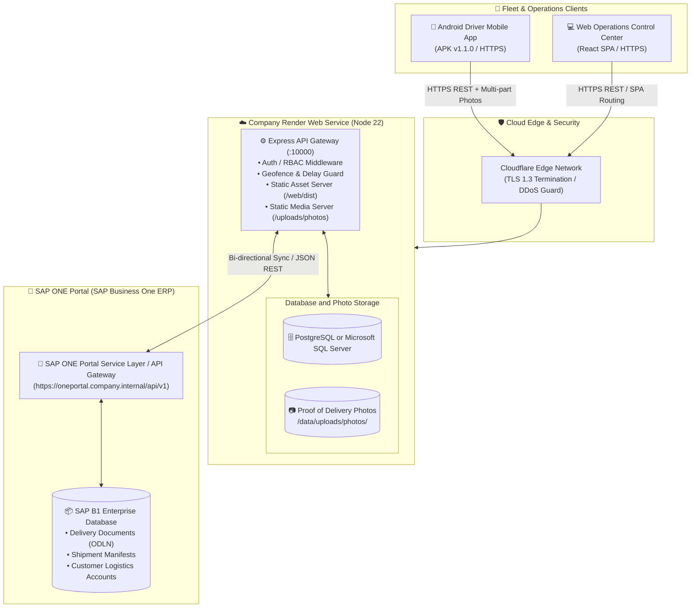

# 🚀 TruckTracker 2.0 — Enterprise Master Rollout & Deployment Guide

This document is the authoritative, step-by-step production runbook for deploying **HoseXperts TruckTracker 2.0** across **Company GitHub**, a company API server or Render staging, the configured PostgreSQL or Microsoft SQL Server database, and **SAP ONE Portal (SAP Business One ERP Gateway)**.

---

## 1. Enterprise Architecture Topology



---

## 2. Prerequisites & Toolchain

Ensure the deployment machine or build agent satisfies the following runtime specifications:

| Component | Required Version | Verification Command |
| :--- | :--- | :--- |
| **Node.js** | `v22.12.0` (LTS) or `v24+` | `node -v` |
| **npm** | `v10.8.0+` | `npm -v` |
| **Git** | `v2.40.0+` | `git --version` |
| **Java JDK** *(optional, for Android APK)* | `OpenJDK 17` | `java -version` |
| **Android SDK** *(optional, for Android APK)* | `API Level 34` | `sdkmanager --list` |

> [!IMPORTANT]
> The backend uses asynchronous database drivers. Set `DB_DRIVER=postgres` for the current Render/Neon deployment or `DB_DRIVER=sqlserver` for the validated company SQL Server deployment. Do not mix the environment variables for the two drivers.

---

## 3. Step 1: Clone & Configure Company GitHub Repository

### 3.1 Clone the Codebase
```bash
git clone https://github.com/Nixxzzzzz/truck_tracker.git
cd truck_tracker
```

### 3.2 Verify and Set Up Git Remotes
Ensure your local branch tracks the primary corporate repository:
```bash
# Verify existing remotes
git remote -v

# If adding the official company remote
git remote add origin https://github.com/Nixxzzzzz/truck_tracker.git
git branch -M main
```

### 3.3 Install Dependencies Across Monorepo
The project uses npm workspaces linking `web`, `server`, and `shared`:
```bash
npm ci --include=dev
```

### 3.4 Build Verification
Verify that both frontend and backend compile cleanly:
```bash
npm run build:all
```
*Output should show:*
* `dist/` created in `web/` with 0 TypeScript/Vite errors.
* `dist/` created in `server/` with 0 TypeScript compilation errors.

---

## 4. Step 2: SAP ONE Portal Integration Setup

TruckTracker integrates directly with your company's **SAP ONE Portal** (powered by SAP Business One Service Layer / ERP Gateway).

### 4.1 Data Mapping Table

| TruckTracker Entity | SAP ONE Portal Object | SAP B1 DB Table | Sync Direction |
| :--- | :--- | :--- | :--- |
| `Trip.id` (`TR-2026-XXXXX`) | Shipment Document | `OSHP` / Custom Table | Bi-directional |
| `Trip.erp_delivery_doc` | Delivery Order Number | `ODLN.DocNum` | Inbound (from SAP) |
| `Trip.sap_shipment_num` | Freight Tracking ID | `ODLN.TrackNo` | Bi-directional |
| `TripStop.destination_name` | CardName / ShipToCode | `CRD1.Address` | Inbound (from SAP) |
| `Photo` (POD Proof) | Attachment Entry | `OATC` / `ATC1` | Outbound (to SAP) |
| `Delay` (Time & Reason) | Logistics Exception Log | UDF `@TRK_DELAYS` | Outbound (to SAP) |

### 4.2 Integration Environment Variables
Configure these in your `.env` (or in the Render Environment Dashboard):

```env
# ==============================================================================
# SAP ONE Portal ERP Integration Gateway
# ==============================================================================
SAP_ONE_PORTAL_URL=https://oneportal.company.internal/api/v1
SAP_ONE_COMPANY_DB=HOSEXPERTS_LIVE
SAP_ONE_USERNAME=b1_dispatcher_service
SAP_ONE_PASSWORD=YourStrongServicePassword2026!
SAP_ONE_SYNC_ENABLED=true
```

### 4.3 Triggering SAP ONE Portal Sync
* **From Manager Dashboard:** Navigate to **Settings** &rarr; **SAP ONE Portal ERP Enterprise Synchronization** &rarr; click **Force Sync SAP ONE Portal**.
* **Via REST API:**
  ```http
  POST /api/sap/sync-all
  Authorization: Bearer <MANAGER_JWT_TOKEN>
  ```
  *(Returns JSON with the count of successfully synchronized trips, delivery documents, and fuel logs).*

---

## 5. Step 3: Deploying on Company Render

### 5.1 Create New Web Service on Render
1. Log in to your company account at [https://dashboard.render.com/](https://dashboard.render.com/).
2. Click **New +** &rarr; select **Web Service**.
3. Connect your repository: **`Nixxzzzzz/truck_tracker`** (or select the company GitHub organization).
4. Configure the following service parameters:

| Field | Value |
| :--- | :--- |
| **Name** | `truck-tracker-api` (or `fleet-management-system`) |
| **Region** | Singapore / Frankfurt / Oregon *(choose closest to fleet)* |
| **Branch** | `main` |
| **Runtime** | `Node` |
| **Build Command** | `npm ci --include=dev && npm run build:all` |
| **Start Command** | `npm run start` |
| **Plan** | **Starter** (Recommended for Persistent Disk) or **Free** |

### 5.2 Configure Health Check Path
* In **Advanced Settings**, set **Health Check Path** to:
  ```text
  /api/health
  ```
  *Render will not switch traffic to a new build until `GET /api/health` returns HTTP 200.*

### 5.3 Configure Persistent Disk for Photos
The PostgreSQL or SQL Server database is external. Uploaded photos are stored at `UPLOADS_DIR`. If photo files must survive deploys and restarts, use a persistent disk or external object storage.

The Render Free plan does not provide persistent disks. If the company chooses Render disk storage, use an eligible paid plan such as Starter and configure:
1. In the service settings, navigate to **Disks** &rarr; click **Add Disk**.
2. **Name:** `trucktracker-data`
3. **Mount Path:** `/data`
4. **Size:** `10 GB` (or larger depending on photo retention).

For the company deployment, set `UPLOADS_DIR` to a directory on the company server's persistent disk, for example `/var/lib/truck-tracker/uploads/photos`. Render is staging only for this architecture; do not use either Render application storage or a Render disk as the company production photo store.

### 5.4 Environment Variables Configuration
In the **Environment** tab on Render, add the following key-value pairs:

```env
NODE_VERSION=22.12.0
NODE_ENV=production
PORT=10000
JWT_SECRET=generate_a_random_64_character_hex_string_here
ALLOWED_ORIGINS=https://fleet-managment-system-2-0.onrender.com,https://truck-tracker-api-9yhq.onrender.com
AUTO_SEED=false
DATABASE_URL=postgresql://<user>:<password>@<host>/<database>?sslmode=require
DB_POOL_MAX=10
DB_SSL=true
DB_SSL_REJECT_UNAUTHORIZED=true

# Initial Administrator Credentials (provisioned if database is brand new)
INITIAL_ADMIN_EMAIL=manager@company.com
INITIAL_ADMIN_PASSWORD=SetSecureCompanyPassword2026!

# Persistent Storage Paths (pointing to mounted disk)
UPLOADS_DIR=/data/uploads/photos

# SAP ONE Portal ERP Integration
SAP_ONE_PORTAL_URL=https://oneportal.company.internal/api/v1
SAP_ONE_COMPANY_DB=HOSEXPERTS_LIVE
SAP_ONE_USERNAME=b1_dispatcher_service
SAP_ONE_PASSWORD=YourStrongServicePassword2026!
SAP_ONE_SYNC_ENABLED=true
```

> [!TIP]
> Setting `AUTO_SEED=false` ensures that no dummy/demo trips or phantom drivers are created in your production database.

### 5.5 Free Tier Cold-Start Mitigation
If deploying on Render Free Tier (which spins down after 15 minutes of idle):
1. Create a free account on [UptimeRobot.com](https://uptimerobot.com/) or [Cron-Job.org](https://cron-job.org/).
2. Create an **HTTP Monitor** targeting:
   ```text
   https://fleet-managment-system-2-0.onrender.com/api/health
   ```
3. Set the monitoring interval to **every 10 minutes**.
4. This ensures the container stays awake 24/7 and eliminates 50-second cold start delays.

### 5.6 Automated Hot Database Backups
Operations managers can trigger zero-downtime hot database backups directly from the REST API:
```bash
curl -X POST https://your-service.onrender.com/api/backup/create \
  -H "Authorization: Bearer <MANAGER_JWT_TOKEN>"
```
This creates a PostgreSQL dump using `pg_dump`. The runtime must have the PostgreSQL client tools installed, or backups should be created through the database provider. You can also configure an external cron job to call this endpoint on a daily schedule.

---

## 6. Step 4: User, Driver & Manager Account Provisioning

TruckTracker enforces role-based access control (RBAC) distinguishing between **Operations Managers** and **Field Drivers**.

### 6.1 Initial Root Manager Account
When the database is newly initialized, the root administrator account is automatically provisioned using the Render environment variables:
* **Email:** Set by `INITIAL_ADMIN_EMAIL`.
* **Password:** Set by `INITIAL_ADMIN_PASSWORD`; there is no production fallback password.

### 6.2 Adding Additional Operations Managers
To provision accounts for secondary dispatchers, operations coordinators, or directors:
1. Log into the Web Portal with any Manager account.
2. In the navigation sidebar, click **Settings** (gear icon).
3. Under the **Operations Team & Manager Access Control** section, click **`+ Add Operations Manager`**.
4. Fill in:
   * **Full Name** (e.g. *Ananya Sen*)
   * **Login Email** (e.g. *ananya@company.com*)
   * **Login Password** (e.g. *manager123* or secure password)
   * **Phone Number** (e.g. *+91 98100 12345*)
5. Click **Create Manager Account**. The user can immediately log in with full manager privileges.

### 6.3 Registering Drivers & Setting Mobile App Credentials
1. From the Manager navigation sidebar, click **Drivers Master** (or Fleet &rarr; Drivers).
2. Click the green **`+ Add New Driver`** button.
3. Complete the driver profile:
   * **Driver Full Name** (e.g. *Vikram Rathore*)
   * **Phone Line** & **Emergency Phone**
   * **Employee ID** (e.g. *EMP-DRV-104*)
   * **Commercial DL #** & Category (Commercial HMV / LMV)
   * **Primary Vehicle Assignment**
4. Under **Driver Login & App Access Credentials**:
   * **Login Email:** Enter the driver's corporate email (e.g. `vikram@company.com`).
   * **Login Password:** Set the login password (defaults to `driver123`, or enter a custom PIN/password).
5. Click **Save & Register Driver**.

> [!TIP]
> **Password Reset for Drivers**: If a driver forgets their password, a manager can open **Drivers Master**, click **Edit** on that driver, enter a new password in the **Reset Password** field, and save.

---

## 7. Step 5: Android Driver App Rollout

Field drivers access the system using the native Android mobile client (`TruckTracker-Driver.apk`).

### 7.1 Download Production APK
Drivers can download the official APK directly from:
* **Web Landing Page:** Click **"Download Native Android Driver App (APK v1.1.0)"** at the bottom of the login screen.
* **Direct GitHub Release URL:**
  ```text
  https://github.com/Nixxzzzzz/truck_tracker/releases/download/v1.1.0/TruckTracker-Driver-v1.1.0-debug.apk
  ```

### 7.2 Building the APK from Source (Optional)
If building a customized release APK:
```bash
cd android
# Build unsigned release APK
./gradlew assembleRelease

# The generated APK will be at:
# android/app/build/outputs/apk/release/app-release-unsigned.apk
```

### 7.3 Over-The-Air Version Telemetry
The backend serves version telemetry at `/api/app-version`:
```json
{
  "version": "1.1.0",
  "versionCode": 2,
  "downloadUrl": "https://github.com/Nixxzzzzz/truck_tracker/releases/download/v1.1.0/TruckTracker-Driver-v1.1.0-debug.apk",
  "mandatoryUpdate": false
}
```
When drivers open the mobile app, it automatically checks this endpoint and prompts drivers to update if a newer build is released.

---

## 8. Step 6: Operational Verification Checklist

After deployment, verify each milestone to confirm production readiness:

- [ ] **1. Service Health:** `curl -s https://<your-service>.onrender.com/api/health` returns `{"status":"healthy"}`.
- [ ] **2. Web Dashboard:** Open `https://<your-service>.onrender.com/` in Chrome; login page loads with clean inputs and no demo buttons.
- [ ] **3. Manager Login:** Sign in with `manager@company.com` and your configured password.
- [ ] **4. Zero Dummy Data:** Check **Reports** tab &rarr; displays 0 delays, 0 recorded bottlenecks (no fake 45m).
- [ ] **5. Locations Master:** Navigate to **Locations Master** tab &rarr; renders without any `latitude.toFixed` crashes.
- [ ] **6. Trip Creation:** Click **Create Trip** &rarr; select driver, vehicle, and add a stop &rarr; trip creates with HTTP 201 (`TR-2026-XXXXX`).
- [ ] **7. Driver Login:** Open `/login` in mobile viewport &rarr; select **Driver** profile &rarr; sign in &rarr; assigned trip loads immediately.
- [ ] **8. SAP ONE Portal Sync:** Navigate to **Settings** → verify SAP ERP reference fields (`sap_shipment_num`, `erp_delivery_doc`) are editable when creating a trip.
