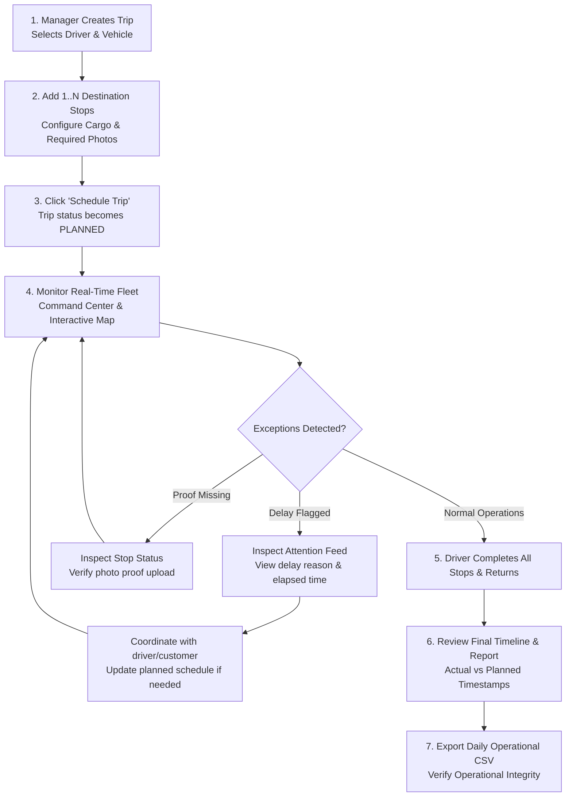

# 📖 TruckTracker — Operations Manual

## Part 1: Field Driver Operations Manual

### Driver Daily Standard Operating Procedure (SOP)

```mermaid
flowchart TD
    Login([1. Sign In to App<br/>Email & Password]) --> ReviewRoute[2. Review Dispatched Route<br/>Stops 1..N & Cargo Details]
    ReviewRoute --> StartTrip[3. Tap 'START TRIP'<br/>Vehicle loaded at depot]
    
    StartTrip --> DriveStop[4. Drive to Destination Stop]
    DriveStop --> CheckDelay{Traffic / Breakdown?}
    
    CheckDelay -- Yes --> ReportDelay[Tap 'REPORT DELAY'<br/>Select reason & submit]
    ReportDelay --> WaitResume[Transit resumes]
    WaitResume --> ResolveDelay[Tap 'RESOLVE DELAY'<br/>Duration auto-calculated]
    ResolveDelay --> ArriveStop
    
    CheckDelay -- No --> ArriveStop[5. Tap 'ARRIVE AT STOP'<br/>Geofence 100-250m checked]
    
    ArriveStop --> DoActivity[6. Unload / Load Cargo<br/>Enter recipient / signoff]
    DoActivity --> CheckPhotoReq{Proof Photo Required?}
    
    CheckPhotoReq -- Yes --> CapturePhoto[Open CameraX Viewfinder<br/>Capture clear photo of cargo/POD]
    CapturePhoto --> ReviewPhoto[Review & Confirm Photo]
    ReviewPhoto --> CompActivity
    
    CheckPhotoReq -- No --> CompActivity[7. Tap 'COMPLETE ACTIVITY']
    
    CompActivity --> DepartStop[8. Tap 'DEPART STOP'<br/>Route counter advances]
    DepartStop --> MoreStops{More Destination Stops?}
    
    MoreStops -- Yes --> DriveStop
    MoreStops -- No --> StartReturn[9. Tap 'START RETURN JOURNEY'<br/>Heading back to company depot]
    
    StartReturn --> ReachBase[10. Tap 'ARRIVE AT BASE'<br/>Vehicle gate arrival recorded]
    ReachBase --> CompleteTrip[11. Tap 'COMPLETE TRIP'<br/>Vehicle released to available pool]
    CompleteTrip --> End([Shift Complete])
```

### Detailed Operational Guidelines

#### 1. Daily Sign In
1. Open the **TruckTracker** app on your company-issued Android device.
2. Enter your Driver Email/ID and Password. Tap **SIGN IN**.
3. The **Driver Home** screen displays your active assigned truck and today's multi-stop route.

#### 2. Starting Your Route
1. When your vehicle is loaded and ready at the company depot, tap **START TRIP**.
2. The server records the departure time and initial depot location.

#### 3. Arriving at a Destination
1. When parked safely at the destination warehouse or customer location, tap **ARRIVE AT STOP**.
2. The app verifies your GPS against the location's 100–250m geofence.
3. If verified, tap **CONFIRM ARRIVAL**. If GPS is weak or obstructed, tap **RETRY GPS CHECK**.

#### 4. Completing Delivery / Activity & Capturing Proof
1. Enter the delivered quantity and the recipient's name or reference signature.
2. If marked **PHOTO REQUIRED**, tap **CAPTURE PROOF PHOTO**.
3. Point your camera at the delivery cargo/waybill and tap the shutter button.
4. Review the image and tap **CONFIRM**.
5. Tap **COMPLETE ACTIVITY**. *(Note: If proof is required, the system strictly blocks departure until the photo is attached).*

#### 5. Departing the Stop
1. After completing cargo activity, tap **DEPART STOP**.
2. The app advances your route counter: `"Stop 2 of 4 Completed"`.

#### 6. Reporting an Operational Delay
1. If delayed by heavy traffic, mechanical breakdown, or customer wait times, tap **REPORT DELAY**.
2. Select the reason (*Traffic Congestion*, *Mechanical Breakdown*, *Adverse Weather*, *Customer Unavailable*, *Accident*) and add optional notes.
3. Tap **SUBMIT DELAY REPORT**. The screen displays a persistent red **ACTIVE DELAY** banner.
4. Once transit resumes, tap **RESOLVE DELAY**. The duration is automatically calculated.

#### 7. Returning to Base Depot & Trip Completion
1. When the final destination stop is completed, tap **START RETURN JOURNEY**.
2. Upon reaching the company depot gate, tap **ARRIVE AT BASE**.
3. Tap **COMPLETE TRIP**. Your vehicle status is released back to `AVAILABLE`.

---

## Part 2: Dispatch Manager Operations Manual

### Dispatch & Exception Handling Lifecycle

### Detailed Dispatch Procedures

#### 1. Creating a Multi-Stop Route
1. Log in to the Web Manager Dashboard.
2. Click **Create Trip** (`+ New Trip`).
3. Select an available **Driver** and **Vehicle**.
4. Set the planned departure time and base depot.
5. Click **Add Destination** to add Stop 1, Stop 2, Stop 3, etc.
6. For each stop, configure customer address, coordinates, cargo details, and whether a proof photo is required.
7. Reorder stops as necessary using the move buttons, then click **Save Trip**.

#### 2. Monitoring Fleet Operations
1. View the **Manager Dashboard** for real-time KPIs: Today's Trips, Vehicles in Transit, Completed, Delayed.
2. Inspect the **Attention Required** feed to quickly address delayed routes, unexpected stops, or missing photos.
3. Open the **Route Map** to view depot locations, destination pins, geofence radius circles (100–250m), and breadcrumb GPS event points.

#### 3. Generating Daily Reports & Exporting Data
1. Navigate to **Reports**.
2. Select the timeframe (**Daily**, **Weekly**, or **Monthly**).
3. Review total trip counts, on-time arrival %, average trip duration, and delay reasons.
4. Click **Export CSV** to download a spreadsheet for company accounting and dispatch records.

#### 4. SAP ONE Portal & Access Control Administration
1. Navigate to **Settings** in the Operations Manager view.
2. Review the **SAP Business One Gateway** parameters (`sap_shipment_num`, `cost_center`, `fleet_unit_id`).
3. Under **Operations Team & Manager Access Control**, provision, edit, or remove dispatch supervisor credentials.
