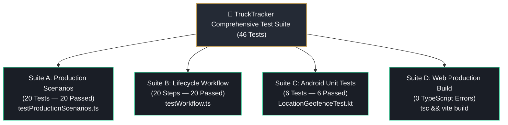

# 🧪 TruckTracker — Verification & Testing Protocol



---

## 1. Automated Test Suites

### Suite A: Production Hardening Scenarios (20 Scenarios)
Verifies real-world operational edge cases and state machine constraints:
```bash
cd server
npx tsx src/testProductionScenarios.ts
```
**Results: 20 PASSED, 0 FAILED**
1. **TEST 01**: Single destination normal trip (HQ → Stop 1 → Return → Base → Complete)
2. **TEST 02**: Two destination normal trip (HQ → Stop 1 → Stop 2 → Return → Base)
3. **TEST 03**: Five destination normal trip (Maintained as ONE trip with stops 1 through 5 in sequence)
4. **TEST 04**: Multiple destination trip with delay reporting
5. **TEST 05**: Multiple destination trip with multiple consecutive delays
6. **TEST 06**: Required delivery photo enforcement (strictly blocks stop departure without proof)
7. **TEST 07**: Optional photo allows continuation without blocker
8. **TEST 08**: GPS unavailable handling (records `GPS UNAVAILABLE`, never fabricates coordinates)
9. **TEST 09**: Poor GPS accuracy recorded faithfully (marks variance if > 300m)
10. **TEST 10**: Network unavailable offline event queue with idempotency keys
11. **TEST 11**: Network returns and synchronizes queue without duplicates
12. **TEST 12**: Failed activity flagged in manager's Attention Required feed
13. **TEST 13**: Invalid driver action state machine rejections (blocks premature departure, double completion, delay after completion)
14. **TEST 14**: Trip cancellation with mandatory audit log reason
15. **TEST 15**: Audit log verification (immutable ledger of mutations)
16. **TEST 16**: Periodic operational report calculation (weekly & monthly metrics)
17. **TEST 17**: Manager edits trip before start with audit log tracking
18. **TEST 18**: Manager reorders destinations before start with automatic stop renumbering
19. **TEST 19**: Unauthorized driver access security guard (Driver A cannot access Driver B's trips)
20. **TEST 20**: Complete 10-stop trip & report calculations verification (trips, stops, delays, CSV export)

### Suite B: Baseline Operational Lifecycle Test (20 Steps)
Verifies full operational continuity from dispatch to reporting:
```bash
cd server
npx tsx src/testWorkflow.ts
```
**Results: 20 PASSED, 0 FAILED**

---

## 2. Multi-Destination Trip Matrix

| Scenario | Stops Count | Verification Focus | Result |
|---|---|---|---|
| **Single Stop** | 1 destination | Base → Stop 1 → Return → Complete | `PASS` |
| **Two Stops** | 2 destinations | Sequential execution & remaining count decrement | `PASS` |
| **Five Stops** | 5 destinations | Order preservation and timeline continuity | `PASS` |
| **Ten+ Stops** | 10 destinations | Single parent Trip ID, batch aggregation, CSV export | `PASS` |

---

## 3. Real Device Testing Protocol (Android)

When testing on physical company Android devices:
1. **Camera**: Capture proof under bright and low-light conditions; verify photo size compression (<2MB) and server timestamp.
2. **GPS Accuracy**: Test inside warehouse (low accuracy/no fix) vs outdoor parking lot (high accuracy). Ensure `GPS UNAVAILABLE` is recorded when satellites are obstructed.
3. **Geofence Verification**: Stand 50m from warehouse gate (inside 150m geofence → verified) vs 500m away (outside geofence → alert displayed).
4. **Network Loss / Reconnect**: Turn Airplane Mode ON while starting return journey; verify event is stored locally with `"Saved — waiting for network"`. Turn Airplane Mode OFF; verify queue drains automatically with 0 duplicate records.
5. **Driver Isolation**: Attempt to view another driver's route via API; verify HTTP 404/403 rejection.
